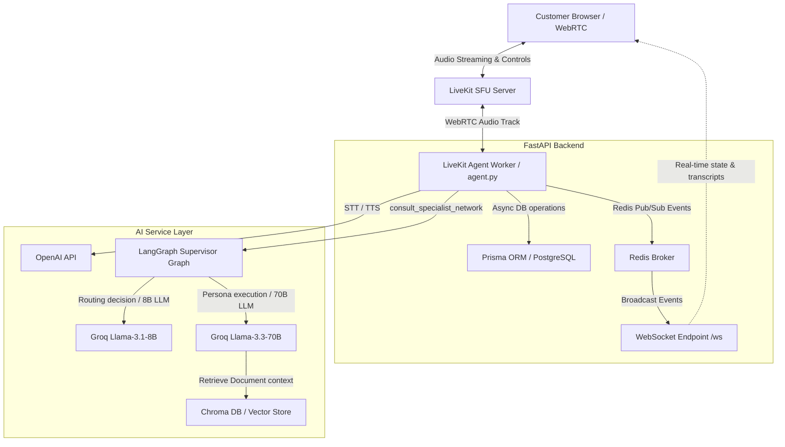
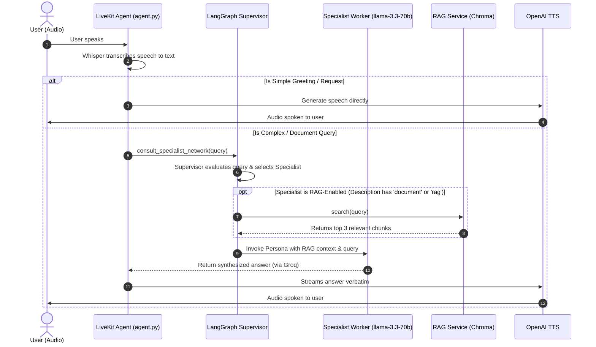

# Call Center AI Voice Agent: Architecture & Latency Guide

This document provides a detailed breakdown of the backend architecture, the multi-agent supervisor flow, and the latency optimizations that enable real-time human-like conversation speeds.

---

## 1. System Architecture

The project is structured into three main blocks: the client-side frontend, the real-time audio pipeline, and the database/AI integration services.



---

## 2. Conversation & Multi-Agent Flow

When a user speaks during a call, the system executes a structured pipeline to transcribe, route, context-enhance, and reply:



### Flow Breakdown:
1. **Real-time Capture:** The user speaks into their browser. Audio packets are sent over WebRTC securely via LiveKit.
2. **STT Transcription:** Whisper STT transcribes the audio packets into text segments.
3. **Core Assistant (Receptionist):** The Receptionist AI parses the transcription. If it detects a request requiring domain knowledge or document references, it calls the `consult_specialist_network` tool.
4. **LangGraph Router:**
   - **Supervisor Node:** Uses `llama-3.1-8b-instant` on Groq to evaluate the user's query against active database persona descriptions.
   - **Dynamic Workers:** Dynamically initializes worker nodes from database persona definitions.
   - **RAG Injection:** If the routed persona's description contains `"document"` or `"rag"`, it triggers a Chroma query. The top 3 document chunks are embedded using OpenAI's `text-embedding-3-small` and appended as context.
   - **Specialist Worker Node:** Calls the specialist LLM (`llama-3.3-70b-versatile` on Groq) with the system prompts and context.
5. **TTS Synthesis:** The text answer is converted back to speech by OpenAI TTS and played to the customer.

---

## 3. Latency Optimization Techniques

Voice assistants must reply within **1.0 to 1.5 seconds** to feel natural. A standard LLM + RAG chain often takes 3.0+ seconds, which ruins the voice experience. This architecture achieves low latency via several specific optimizations:

### Optimization A: Groq LPUs for Inference (Sub-200ms)
- **Problem:** Running a large 70B parameter model like `llama-3.3-70b` on standard cloud GPUs takes 1.5 to 2.5 seconds to generate response tokens.
- **Solution:** The specialist worker nodes are powered by **Groq LPU (Language Processing Unit)** hardware. Groq serves tokens at speeds of **200+ tokens/second**. The entire inference generation, including complex reasoning and context evaluation, completes in less than **250ms**.

### Optimization B: The Verbatim Repeat Rule (No Double LLM Processing)
- **Problem:** In tool-calling setups, once a tool returns an answer, the calling LLM (Receptionist AI) processes it again to summarize or phrase it, doubling the token generation delay.
- **Solution:** The Receptionist prompt contains a strict rule:
  > *"...When the 'consult_specialist_network' function returns an answer, you MUST speak that exact answer verbatim to the user IMMEDIATELY. Do not add introductory words... Do not summarize. Just output the exact answer so it can be spoken to the user as fast as possible."*
  This ensures that as soon as Groq generates the specialist response, it is sent straight to the TTS generator, eliminating secondary LLM generation delay.

### Optimization C: Preemptive TTS Streaming
- **Problem:** Standard TTS engines wait for the LLM to generate the entire paragraph before converting it to audio, creating a massive delay.
- **Solution:** In `agent.py`, the voice agent is initialized with:
  ```python
  session = AgentSession(
      ...,
      preemptive_generation=True,
  )
  ```
  This tells the LiveKit agent to stream LLM tokens directly to the TTS engine. The TTS converts the first few words into audio and starts playing them to the user *while* the remainder of the sentence is still being generated. The Time-to-First-Byte (TTFB) of speech drops to **under 400ms**.

### Optimization D: Efficient Async DB & Vector IO
- **Problem:** Database queries blocking the main threat slow down WebRTC frame transmission.
- **Solution:**
  - **Prisma Client Python** executes all database operations asynchronously using `async`/`await`.
  - **Redis Pub/Sub** decouples database event logging (saving transcript messages and updating state) from the audio connection loop, preventing database I/O from causing voice stuttering.

---

## 4. Scenario Walkthroughs in Detail

### Scenario A: General Chit-Chat (No Specialist Needed)
1. **User Speaks:** *"Hi, how's your day going?"*
2. **Audio Stream:** Audio packet goes from browser to LiveKit, which passes it to `agent.py`.
3. **Transcription (Whisper):** The STT engine transcribes the text.
4. **Prompt Evaluation:** The main `Assistant` LLM (`gpt-4o-mini`) processes the input.
5. **No Routing Triggered:** The LLM checks its instructions and determines that this does not require a specialized persona or document search.
6. **Response Generation:** The receptionist LLM immediately returns a friendly response (e.g. *"Hello! I'm having a great day, thanks for asking. How can I help you today?"*).
7. **Audio Rendered:** The text streams to OpenAI TTS, which converts it to audio and streams it to the user.
8. **Logging:** The WebSocket API broadcasts the transcript to update the user's screen.

### Scenario B: Asking a Complex Policy/RAG Question
1. **User Speaks:** *"What is the refund policy for VoiceAI?"*
2. **Transcription:** Whispered STT yields: `"What is the refund policy for VoiceAI?"`
3. **Receptionist Evaluation & Tool Call:** The receptionist LLM realizes it doesn't have the factual knowledge to answer and triggers `consult_specialist_network(query="What is the refund policy for VoiceAI?")`.
4. **LangGraph Processing:**
   - **Supervisor Route:** The supervisor (`llama-3.1-8b-instant`) matches the query to the `Customer_Support` persona description (since it contains "refund policies"). It selects `"Customer_Support"`.
   - **RAG Lookup:** The pipeline matches `"Customer_Support"`'s description, finds keywords like "documents/knowledge base", and triggers `rag_service.search`.
   - **Chroma Query:**
     - Query is embedded into a 1536-dimensional vector.
     - Chroma searches the database and returns the top 3 text chunks from the `VoiceAI Customer Support Knowledge Base.pdf`.
   - **Specialist Answer:** The worker node receives the chunks as context and runs `llama-3.3-70b-versatile` on Groq, returning the response: *"According to our VoiceAI Customer Support Knowledge Base, refunds are available within 14 days of purchase..."*
5. **Visual Persona Update:** The system updates the session's active persona in PostgreSQL to `Customer_Support` and broadcasts a `persona_update` WebSocket event. The frontend header and sidebar instantly change from `DEFAULT` to `CUSTOMER_SUPPORT`.
6. **Verbatim repeat:** The Receptionist AI outputs the exact string, which is immediately spoken back to the user via TTS.

### Scenario C: Uploading a Document in the Admin Panel
1. **File Selection:** The admin selects a PDF (e.g. `VoiceAI_Sales_Guide.pdf`) and hits upload.
2. **Server Route:** The file goes to `/admin/knowledge/upload` in `admin_routes.py`.
3. **Prisma DB Entry:** The server writes a new record to the `Document` table with `processed = False`.
4. **Chroma Ingestion (`rag_service.py`):**
   - `PyPDFLoader` reads and extracts text pages.
   - `RecursiveCharacterTextSplitter` chunks the text into overlapping sections (size: 1000 chars, overlap: 200 chars).
   - OpenAI `text-embedding-3-small` embeds all text chunks into vector arrays.
   - Vectors are written into the Chroma database using unique UUIDs prefixed with the database record ID (e.g. `doc_6_a2f8...`).
5. **Completion:** The database `processed` field is set to `True`, the local temp file is removed, and the admin panel shows the document status as "Processed".

### Scenario D: Ending a Call (Hang-up & Memory Consolidation)
1. **User Hangs Up:** The customer disconnects WebRTC.
2. **Disconnect Listener:** LiveKit triggers `disconnected` on the agent worker.
3. **Database Analysis:**
   - **Fetch Messages:** `agent.py` pulls all chat messages logged during the call from the PostgreSQL `Message` table.
   - **Generate Summary:** Feeds the transcript to GPT-4o-mini to compile a `Summary` model entry containing: a summary paragraph, user facts, open issues, and action items.
   - **Generate Memory:** Compiles previous user memory + the new summary to update the user's permanent record (`UserMemory` table). Next time they call, the agent will load this memory at startup and greet them contextually!
4. **Final DB Update:** The session `endedAt` time is stored, and the session status is set to `COMPLETED`.
